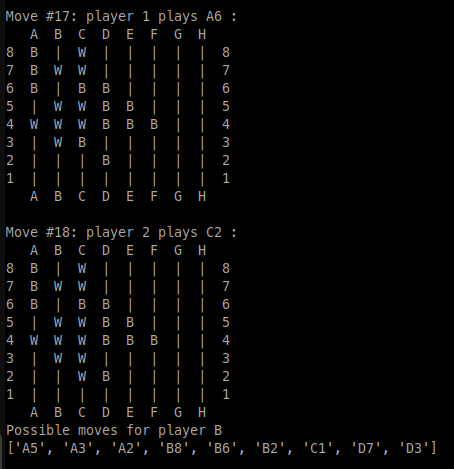
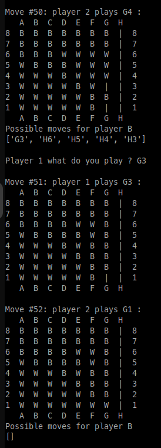

# Reversi game
Authors: Michał Siwek, Zuzanna Bernacka

Reversi game project for college Artificial Intelligence Tools subject.<br>
Reversi is a strategy board game for two players played on 8x8 board. Players fill the board with pawns of color assigned to them.<br>
Each pawn have black and white colors on reverse sides. The player that fills the board with more pawns of his color wins the game.<br>

Implementation for Reversi game with easyAI computer opponent.<br>
Code has been developed in PyCharm.

Used external libraries:

* numpy - [link](https://numpy.org)
* easyAI - [link](https://github.com/Zulko/easyAI/tree/master)

Sources of help/inspiration:

* easyAI reversi example game (code fragments altered by us) - [link](https://github.com/Zulko/easyAI/blob/master/easyAI/games/Reversi.py)

Game board has borders:

* vertical - descending in digit values (8-1)
* horizontal - ascending in letter values (A-H)

<h1>Installation and running instructions (for Ubuntu)</h1>

```
apt-get update && apt-get install -y python3 python3-pip
python3 -m pip install numpy easyai
python main.py
```

<h1>Gameplay instruction:</h1>
Player starts as Black pawn - "B" letter on displayed game board, possible moves are presented to you as described below.<br>
To make move as a player type the coordinates from given list of possible moves for example:<br>
<i><b>
Possible moves for player B<br>
['C5', 'D6', 'E3', 'F4']
</b></i>

Player 1 what do you play ? -> HERE GOES YOUR INPUT eg. C5

[Rules wikipedia page](https://pl.wikipedia.org/wiki/Reversi)

<h1>Gameplay example</h1>





